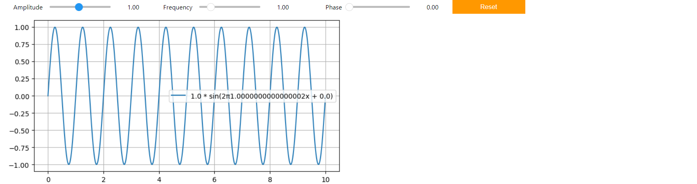

# Data Visualization ✨📊

This project showcases interactive data visualization using **Matplotlib** and **ipywidgets**. Users can dynamically customize a sine wave plot by adjusting amplitude, frequency, and phase using sliders and a reset button.

---

## 🔧 Features
1. **Interactive Widgets**:
   - **Amplitude Slider**: Adjust the wave amplitude (range: 0.1 to 2.0).
   - **Frequency Slider**: Modify the wave frequency (range: 0.1 to 5.0).
   - **Phase Slider**: Change the phase shift (range: 0 to 2π).
   - **Reset Button**: Reset sliders to their default values.

2. **Dynamic Plot Updates**:
   - A sine wave plot updates in real-time based on slider adjustments.
   - Displays the mathematical representation of the wave in the plot legend.

---

## 🚀 How to Run the Project

1. Install required libraries:
   ```bash
   pip install numpy matplotlib ipywidgets
   ```

2. Enable widgets in Jupyter Notebook (if using Jupyter):
   ```bash
   jupyter nbextension enable --py widgetsnbextension
   ```

3. Run the script:
   - Use a Jupyter Notebook or JupyterLab to execute the script for interactive functionality.

---

## 🕊️ Code Walkthrough

### Initialization:
- Import necessary libraries (`numpy`, `matplotlib`, `ipywidgets`).
- Set up default values for amplitude, frequency, and phase.

### Widgets:
- **Sliders**: Allow users to adjust amplitude, frequency, and phase values.
- **Reset Button**: Resets sliders to their default states.

### Update Function:
- Recalculates and redraws the sine wave plot based on current slider values.

### Integration:
- Combine sliders and output area in a graphical interface using `ipywidgets`.

---

## 📊 Example Output

### Interactive Sine Wave Plot:


- Adjust sliders to observe the wave transformation in real-time.

---

## 📖 Technologies Used
- **Programming Language**: Python
- **Libraries**:
  - `numpy` for mathematical computations.
  - `matplotlib` for plotting.
  - `ipywidgets` for interactive GUI elements.

---

## 🙏 Contributing
Contributions are welcome! Feel free to open an issue or submit a pull request.
